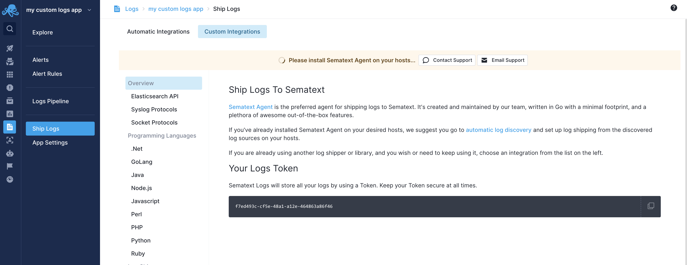

title: Sematext Agent Custom Logs Configuration
description: Custom Logs Configuration for Sematext Agent

Sematext Agent supports configuring log shipping through a YAML file, `custom-logs.yml`. This feature allows users to specify log file locations and custom parsing rules, which is useful for log files not [discovered automatically](https://sematext.com/docs/fleet/discovery/) or when custom log parsing rules are needed.

## How it works

The Sematext Agent periodically checks the `custom-logs.yml` file. If valid log shipping rules are found, the agent starts collecting, parsing, and shipping logs from the specified files to the Sematext Cloud Logs App that matches the provided App token. You can configure multiple log files, multiple parsing rules, and multiple destination Logs Apps. To stop log shipping, remove the rule(s) from the file.

## Requirements

Sematext Agent [version 3.6.0](https://sematext.com/docs/agents/sematext-agent/releasenotes/#version-360) and newer.

## How to start

[Create a new Logs App](https://sematext.com/docs/logs/quick-start/) in Sematext Cloud. If you have custom log files, create a [Generic Logs App](https://sematext.com/docs/integration/generic-logs-integration/). For log files generated from one of our [supported integrations](https://sematext.com/docs/integration/), create a Logs App of the relevant type.

As soon as the Sematext Agent is installed, ignore the Discovery screen and keep a copy of the App token. To retrieve this token, navigate to the **Ship Logs** screen from the left Menu panel and select **Custom Integrations**.



The next step is to edit the `custom-logs.yml` file (see below) with your own log rules.

Once this is done, the logs will start shipping to your Logs App.

## File location

Edit the `custom-logs.yml` file in the configuration directory of your Sematext Agent. For baremetal environments it's under the `/opt/spm/properties/` directory.

## File structure

```yaml
myapp-logs:                                                                         # log type           
  files: ["/path/to/myapp.log"]                                                     # log file paths
  token: "your-sematext-logs-app-token"                                             # Sematext Cloud Logs App token
  isJSON: false                                                                     # for JSON formatted files 
  regexPatterns:                                                                    # regex patterns to parse logs
    - '^(?P<timestamp>\d{4}-\d{2}-\d{2}[\s|T][\d+|:]+.\d+)\s(?P<message>[\s|\S]+)'
  patternTypes:                                                                     # data types for each regex pattern
    timestamp: "string"
    message: "string"
```

## Configuration Details

Each section in the `custom-logs.yml` file defines a log shipping rule. There are also several variables to configure how the Sematext Agent collects and parses your log files. You can configure multiple log shipping rules in the file.

### Log type

- **Description**: The type of your logs. You can define your own type or use a pre-defined type. The type name should be in lowercase kebab case, meaning it should use lowercase letters with words separated by dashes (e.g., `myapp-logs` or `my-other-app-logs`).
- **Required**: Yes
- **Example**: `myapp-logs` which is a custom type, `nginx` which is pre-defined

The log type can be a custom type defined by the user or a pre-defined type that maps to one of Sematext's supported Logs Apps (e.g., `nginx` for Nginx Logs). All available types can be found below.

| Integration                          | Type                     |
|--------------------------------------|--------------------------|
| ActiveMQ                             | activemq                 |
| Apache                               | apache                   |
| Elasticsearch                        | elasticsearch            |
| OpenSearch                           | opensearch               |
| JVM apps                             | jvm                      |
| Linux daemons                        | linux-daemon             |
| MySQL                                | mysql                    |
| Nginx                                | nginx                    |
| Postgres                             | postgresql               |
| RabbitMQ                             | rabbitmq                 |
| Solr                                 | solr                     |
| Varnish Cache                        | varnishcache             |

### `files`

- **Description**: Specifies the paths to the log files. You can use either block sequence format (e.g., `files:` followed by a list of paths each on a new line with a dash) or inline sequence format (e.g., `files: ["/path/to/file1", "/path/to/file2"]`). Glob patterns are not supported.
- **Required**: Yes
- **Example**:

```yaml
  files: ["/path/to/file1", "/path/to/file2"]
```

or

```yaml
  files:
    - "/path/to/file1"
    - "/path/to/file2"
```

### `token`

- **Description**: The token for your Sematext Cloud Logs App.
- **Required**: Yes
- **Example**:

```yaml
  token: "af526914-15fe-481e-b06c-e7e07daf793c"
```

### `isJSON`

- **Description**: Set to `true` if your log files are JSON formatted. If `true`, `regexPatterns` and `patternTypes` are not needed and if specified will be ignored.
- **Required**: No
- **Default**: `false`
- **Example**:

  ```yaml
  isJSON: true
  ```

### `regexPatterns`

- **Description**: Defines the regex patterns to parse logs. If defined, pre-defined types won't be used. Regular expressions are wrapped with single quotes (r'...'). The value between the quotes uses the [Rust regex syntax](https://docs.rs/regex/latest/regex/#syntax). To verify your regex patterns, you can use tools like [Rustexp](https://rustexp.lpil.uk/) and [Regex101](https://regex101.com/).
- **Required**: No
- **Example**:

```yaml
  regexPatterns:
    - '^(?P<timestamp>\d{4}-\d{2}-\d{2}[\s|T][\d+|:]+.\d+)\s(?P<message>[\s|\S]+)'
```

### `patternTypes`

- **Description**: Defines the data types for each regex pattern parser group. Supported types include `string`, `int`, `float` and `bool`.
- **Required**: No
- **Example**:

```yaml
  patternTypes:
    timestamp: "string"
    message: "string"
```


## Example configurations

### NGINX Logs

Using a pre-defined type for Nginx logs:

```yaml
nginx:
  files: ["/var/log/nginx/access.log"]
  token: "3d542016-4255-4de4-9b69-03b6066e0155"
```

### JSON Formatted Logs

For logs in JSON format:

```yaml
a-json-logs-app:
  files: ["/var/log/myapp/myapp.json", "/var/log/myapp/errors.json"]
  isJSON: true
  token: "af526914-15fe-481e-b06c-e7e07daf793c"
```

### Custom Log Format

Let's say we have two log files named `myapp.log` and `errors.log` in the `/var/log/myapp/` folder that contain log events like the ones below:

```
2024/07/16 12:07:16 [WARN] 6423#3847: User account deleted
2024/07/16 12:08:16 [INFO] 6423#5403: User updated profile
2024/07/16 12:09:16 [INFO] 6423#9266: User updated profile
2024/07/16 12:10:16 [INFO] 6423#7614: User role changed
```

Below is the log rule that needs to be added in `custom-logs.yml` file:

```yaml
myapp-logs:
  files:
    - "/var/log/myapp/myapp.log"
    - "/var/log/myapp/errors.log"
  token: "0d63b278-4eae-40de-8862-db6b490634db"
  regexPatterns:
    - '^(?P<timestamp>\d{4}/\d{2}/\d{2}\s[\d|:]+)\s\[(?P<level>.+?)]\s(?P<pid>\d+)#(?P<tid>\d+):\s(?P<message>.*)'
  patternTypes:
    timestamp: "string"
    level: "string"
    pid: "int"
    tid: "int"
    message: "string"
```

## Troubleshooting tips and known issues

- Support for Windows is coming soon
- Support for Kubernetes and containerized environments is coming soon
