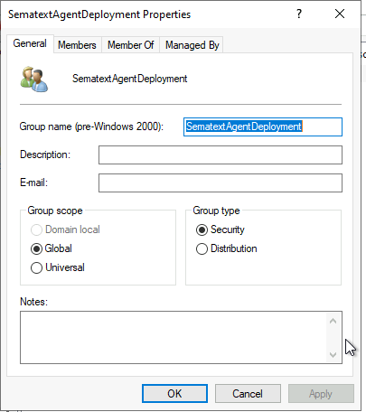
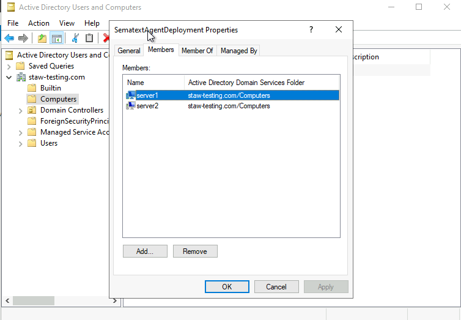
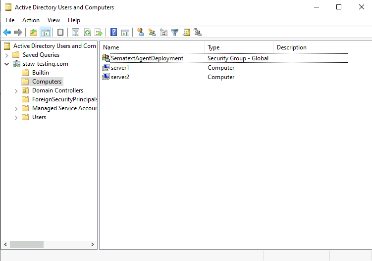
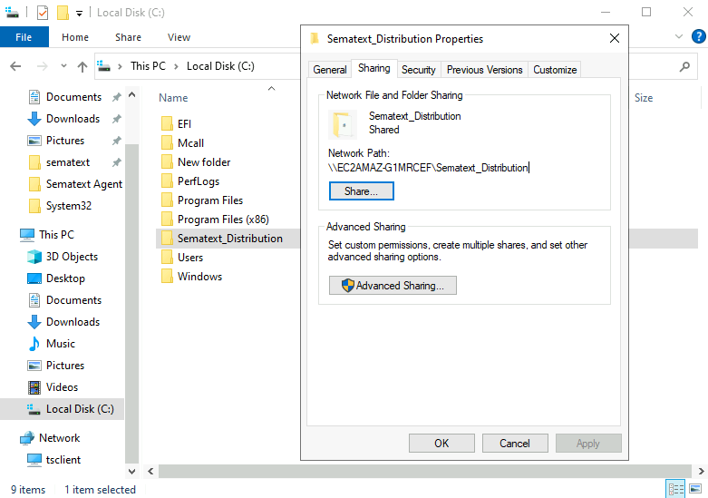
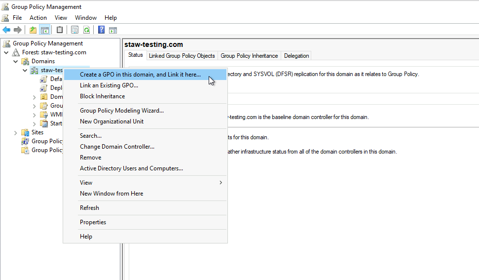
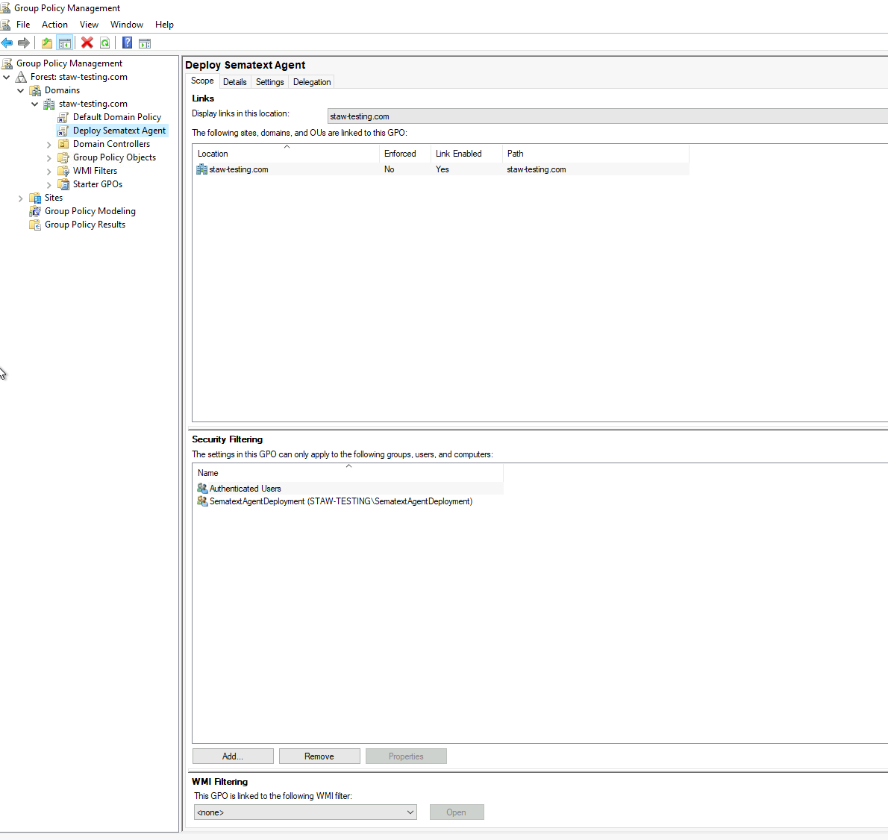
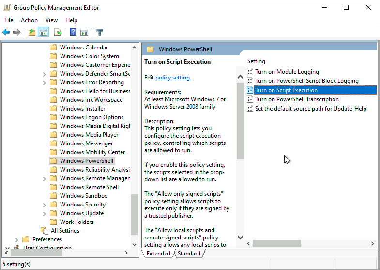
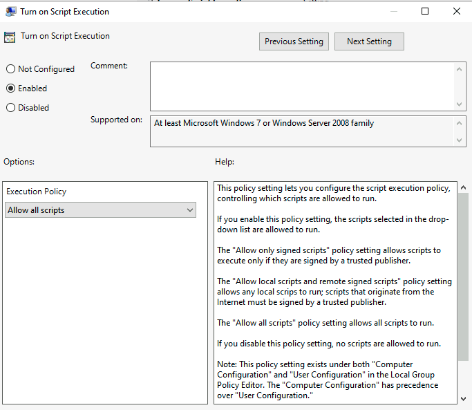

title: Installing Sematext Agent on Windows

Sematext Agent collects a plethora of metrics about Windows hosts (CPU, memory, disk, network, processes). The installer is responsible for installing the Sematext Agent, configuring it, and starting it as a Windows Service.

Installation can be done either by using the GUI installer or through the command line.

## Preconditions

Before starting, please check the [platform support policy](https://sematext.com/docs/agents/sematext-agent/platform-support-policy/) page to make sure your Windows platform is supported.

To see your Windows host metrics in Sematext Cloud, you need to [create an Infra App](https://sematext.com/docs/monitoring/infrastructure/#create-an-infra-app) and select the Windows environment. This will provide you with an Infra App token, which is essential for establishing a secure link between Sematext Cloud and Sematext Agent.

## Install from GUI

1. Download the [Sematext Agent installer](https://pub-repo.sematext.com/windows/pool/main/s/sematext-agent/sematext-agent-latest.msi)
2. Follow the installation steps and accept the license agreement 
3. Set the Infra App token
4. Select a region (EU or US) based on where you created your account in Sematext Cloud

After completing these steps, Sematext Agent will be automatically started as a Windows Service.

## Install from command line

Download the [Sematext Agent installer](https://pub-repo.sematext.com/windows/pool/main/s/sematext-agent/sematext-agent-latest.msi).

### Using PowerShell

Run the following command as Administrator from the folder where you downloaded the installer:

```
Start-Process -Wait msiexec -ArgumentList "/qn /i $($msiFileName = 'AGENT_MSI_INSTALLER'; $msiFileName) /L*V `"$msiFileName.log`" INFRA_APP_TOKEN=YOUR_INFRA_TOKEN REGION=YOUR_REGION_EU_or_US"
```

Where:

- `YOUR_INFRA_APP_TOKEN`: the Infra App token
- `YOUR_REGION_EU_or_US`: your Sematext Cloud region - EU or US
- `AGENT_MSI_INSTALLER`: the filename of the Sematext Agent Windows installer

For example:

```
Start-Process -Wait msiexec -ArgumentList "/qn /i $($msiFileName = 'sematext-agent-latest.msi'; $msiFileName) /L*V `"$msiFileName.log`" INFRA_APP_TOKEN=7511db7f-c060-4e10-b667-5f2653d4933e REGION=EU"
```

### Using Windows CMD:

Run the following command as Administrator from the folder where you downloaded the installer:

```
start /wait msiexec /qn /i "AGENT_MSI_INSTALLER" /L*V "AGENT_MSI_INSTALLER.log" INFRA_TOKEN=YOUR_INFRA_APP_TOKEN REGION=YOUR_REGION_EU_or_US
```

Where:

- `YOUR_INFRA_APP_TOKEN`: the Infra App token
- `YOUR_REGION_EU_or_US`: your Sematext Cloud region - EU or US
- `AGENT_MSI_INSTALLER`: the filename of the Sematext Agent Windows installer

For example:

```
start /wait msiexec /qn /i "sematext-agent-latest.msi" /L*V "sematext-agent-latest.msi.log" INFRA_APP_TOKEN=7511db7f-c060-4e10-b667-5f2653d4933e REGION=EU
```

After completing these steps, Sematext Agent will be automatically started as a Windows Service.

## Deploying using Group Policy

These steps will walk you through deploying the Sematext Agent using Group Policy on a Windows Server environment. It covers both server and client-side configurations and includes steps for creating a new security group for targeted deployment. Deploying software via Group Policy allows for automated, consistent, and scalable deployments across multiple machines, ensuring that all systems are up-to-date with the latest version of Sematext Agent.

### Server-Side configuration

#### 1. Create a new security group

##### Open Active Directory Users and Computers
- Open the **Active Directory Users and Computers** console on your server.

##### Create a new group
- Under the domain, right-click on the **Computers**, select **New** > **Group**.
- Name the group (e.g., `SematextAgentDeployment`).
- Make sure the **Group scope** is set to **Global** and **Group type** is set to **Security**.

  

##### Add computers to the group
- Right-click the newly created group, select **Properties**.
- Go to the **Members** tab and click **Add**.
- Enter the names of the computers you want to deploy the Sematext Agent. Click **Check Names** to validate they are recognized by Active Directory, then click **OK**.

  
  


#### 2. Prepare the Sematext Agent installer
- Download the [Sematext Agent installer](https://pub-repo.sematext.com/windows/pool/main/s/sematext-agent/sematext-agent-latest.msi).
- Create a PowerShell script that will be used to run the MSI installer and save it with a .ps1 extension, for example, install_sematext_agent.ps1:

  ```
  Start-Process -Wait msiexec -ArgumentList "/qn /i $($msiFileName = 'sematext-agent-latest.msi'; $msiFileName) /L*V `"$msiFileName.log`" INFRA_APP_TOKEN=7511db7f-c060-4e10-b667-5f2653d4933e REGION=EU"
  ```

  Make sure to update `INFRA_APP_TOKEN` with your Infra App token and `REGION` with `US` or `EU` depending on your Sematext Cloud region. Also validate that the file name of the MSI installer is correct.

#### 3. Create a shared network folder
- Create a shared folder on your server, for example, `\\ServerName\Sematext_Distribution`.
- Place both install_agent.ps1 and sematext-agent-latest.msi into this shared folder.
- Set permissions on the shared folder and add the group `SematextAgentDeployment` so that all computers in the network have read access.

  

#### 4. Create a new Group Policy Object (GPO)
- On your server, open the **Group Policy Management Console (GPMC)**. You can do this by typing `gpmc.msc` in the Run dialog (Win + R).
- In the Group Policy Management Console, right-click on the domain where your client computers reside and select **Create a GPO in this domain, and Link it here…**.
- Name the GPO something descriptive like `Deploy Sematext Agent`.

  

#### 5. Scope the GPO to the group
- Select the newly created GPO in the tree.
- Under the **Security Filtering** section, click **Add**.
- Enter the name of the group you created (e.g., `SematextAgentDeployment`), click **Check Names**, and then click **OK**.

  

#### 6. Configure the GPO to run the script
- Right-click the newly created GPO and select **Edit**.
- In the Group Policy Management Editor, navigate to **Computer Configuration** > **Policies** > **Windows Settings** > **Scripts (Startup/Shutdown)**.
- Double-click on Startup, select the **PowerShell Scripts** tab and then click **Add...**.
- In the Add a Script dialog, click **Browse...** and navigate to the shared folder and select `install_sematext_agent.ps1`.

  

#### 7. Verify that PowerShell execution policy is set
Make sure the PowerShell execution policy on target machines allows the script to run:
- In the Group Policy Management Editor, navigate to **Computer Configuration** > **Policies** > **Administrative Templates** > **Windows Components** > **Windows PowerShell**.

  
  
- Enable the policy **Turn on Script Execution** and set it to **Allow all scripts**.

  

### Client-Side configuration

#### 1. Client machine requirements
- Confirm all client machines are joined to the domain and are members of the group you created.
- Verify client machines have network access to the shared folder containing the installer files.

#### 2. Force Group Policy update
- On a client machine, open Command Prompt with administrative privileges.
- Run the following command to force a Group Policy update:

  ```shell
  gpupdate /force
  ```

#### 3. Verify installation
- After the Group Policy update, restart the client machine.
- Log in and verify that the Sematext Agent has been installed and started as a Windows Service.

### Troubleshooting tips

1. **Check Network Access**
   - Verify the client machines can access the shared folder by browsing to the network path (e.g., `\\ServerName\Sematext_Distribution`) from a client machine.

2. **Review Event Logs**
   - On the client machine, check the Event Viewer under **Applications and Services Logs** > **Microsoft** > **Windows** > **GroupPolicy** for any errors related to software installation.

3. **Check GPO Application**
   - Confirm the GPO is correctly applied to the client machine by running `gpresult /r` in the Command Prompt on the client machine.

4. **Review GPO Settings**
   - Validate the GPO settings in the Group Policy Management Editor to verify the deployment is configured correctly.


## How to check the Sematext Agent service status

### Windows Services

Open Windows Services and find the Sematext Agent service:


### Command line

Run the following command:

```
cd  'C:\Program Files\Sematext Agent\' .\st-agent-amd64.exe windows-service status
```

## How to start / stop / restart Sematext Agent

To start, stop or restart the Sematext Agent, you can perform these actions through the GUI:

- Start: Open the Windows Services application by searching for "Services" in the Windows search bar, locate "Sematext Agent" in the list of services, right-click on it, and select "Start"
- Stop: Similarly, in the Services application, locate "Sematext Agent", right-click on it, and select "Stop"
- Restart: To restart the Sematext Agent, you can either stop and then start it again using the aforementioned steps or right-click on "Sematext Agent" in the Services application and select "Restart"

Alternatively, you can use the command-line interface by running one of the following commands as Administrator:

Start:

```
cd 'C:\Program Files\Sematext Agent\'
.\st-agent-amd64.exe windows-service start
```

Stop:

```
cd  'C:\Program Files\Sematext Agent\'
.\st-agent-amd64.exe windows-service stop
```

Restart:

```
cd  'C:\Program Files\Sematext Agent\'
.\st-agent-amd64.exe windows-service restart
```

## How to check Sematext Agent logs

Sematext Agent logs are located in the `C:\Windows\System32\config\systemprofile\AppData\Local\sematext-agent` folder.

For example, you can access the logs file like below;

```
cd C:\Windows\System32\config\systemprofile\AppData\Local\sematext-agent

notepad.exe .\logs\st-agent.log
```

## How to change Infra App token or region

You can either reinstall Sematext Agent through GUI or by running the following command from command line:

```
cd  'C:\Program Files\Sematext Agent\'
.\st-agent-amd64.exe windows-config set-token -t "YOUR_INFRA_TOKEN"
.\st-agent-amd64.exe windows-config set-region -r "YOUR_REGION_EU_or_US"
```

After the changes, you need to restart the agent:

```
.\st-agent-amd64.exe windows-service restart
```

## How to unistall Sematext Agent

You can uninstall Sematext Agent using the GUI installer or from Windows Settings > Apps.

## Limitations / Known Issues

The Sematext Agent for Windows is still a work in progress and has some limitations:

- Discovery and configuration of services and log sources are not yet supported
- Inventory functionality is not yet available
- Custom tags cannot be created
- Sematext Agent for Windows is in Beta.  
  You may see the "Unknown Publisher" warning while installing the agent on your Windows host.  
  We are aware of this and will solve it soon. The SHA256 hash of the installer file if you need to verify its validity:
  ```
  9d1c1f08b67ff9b3bfc3bab2f7cc3ab96f3ca1d7d8a132caaa8019fe50b220cf  sematext-agent-latest.msi
  ```
  
