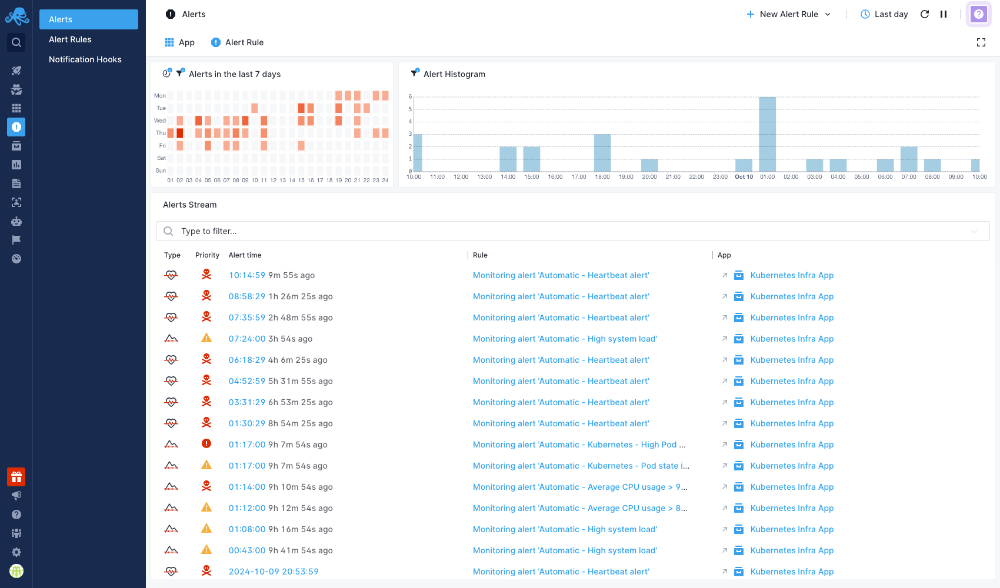
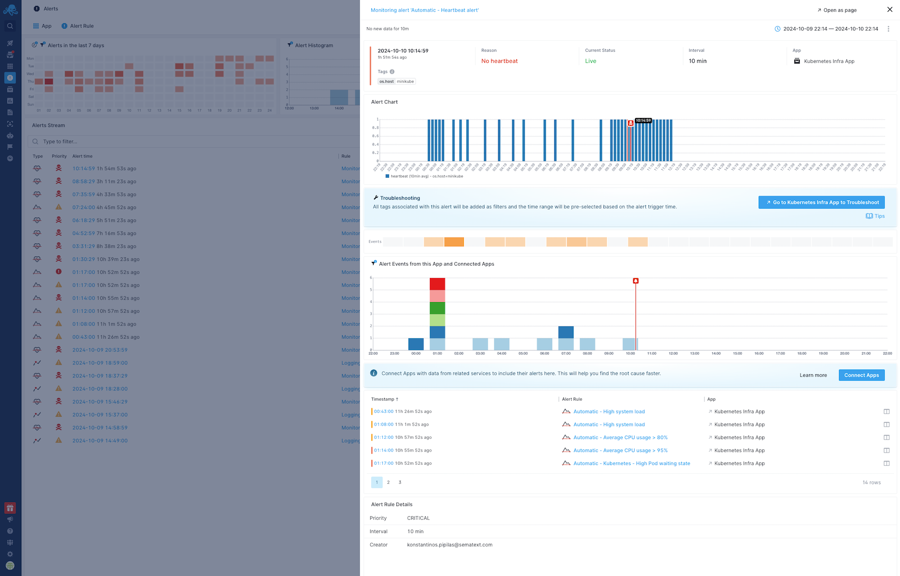
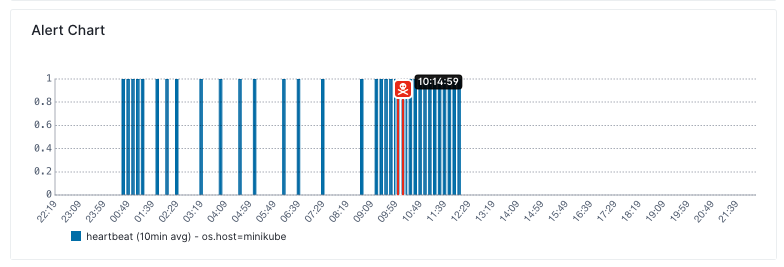
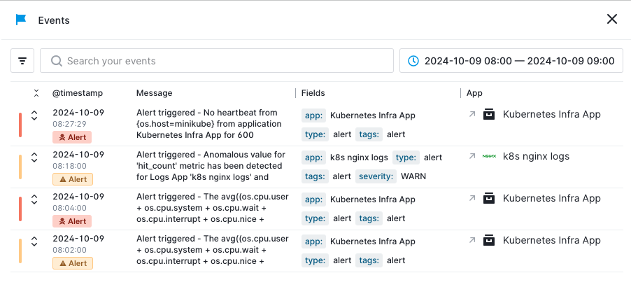
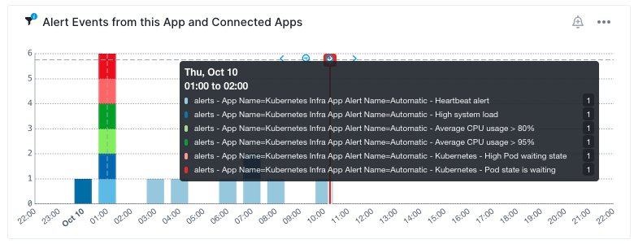
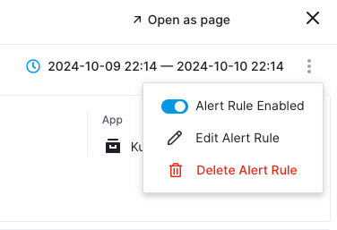

title: Alert Events
description: Observe triggered alerts and understand their significance in monitoring your applications.

Alert events are critical indicators that inform you when certain conditions within your applications or infrastructure are met. They serve as alerts for potential issues that may require immediate attention, making sure that you can maintain optimal performance and uptime for your services.

## Viewing Alert Events

In the **Alerts** page ([US](https://apps.sematext.com/ui/alerts/events) or [EU](https://apps.eu.sematext.com/ui/alerts/events)), you can easily observe and analyze triggered alerts. This view includes a 24/7 heatmap, histogram, and a detailed table displaying alerts triggered within the selected time period.

### Visualizations

- **Heatmap:** Offers a quick visual representation of alert frequency over time, allowing you to identify patterns at a glance.
- **Histogram:** Displays the distribution of alert events across the selected time period, helping you understand when alerts are most frequently triggered.
- **Alerts table:** Lists all triggered alerts, sortable by various parameters.

### Accessing Alert Events

By default, alerts for all Apps are displayed. However, you can filter alerts to focus on specific parameters. Here's how:

- **Filter by App:** Use the dropdown menu at the top of the alerts table to select one or more Apps.
- **Filter by alert rule:** Use the dropdown menu at the top of the alerts table to select one or more alert rules.
- **Time range:** Adjust the time range using the date picker to view alerts for specific periods.
- **Alerts Stream search bar:** Use the search bar at the top of the **Alerts Stream** table to search for a specific text string.

### User Actions

- **Viewing alert details:** Click on the timestamp of an alert in the alerts table to view detailed information.
- **Viewing alert rule details:** Click the alert rule name in the alerts table to view detailed information about the specific rule.
- **Go to App:** Click the App name in the alerts table to visit the App for which this alert was created.
- **Create new alert rule:** Use the **New Alert Rule** dropdown menu at the top right of the page to create a new alert rule.

## Alert Event Details

Upon clicking an alert in the alerts table, you will be taken to a detailed view that provides comprehensive information about the selected alert event.

### Alert Event Summary

At the top of the alert event detail view, you'll find key information that varies based on the alert type, including:

- **Triggered Time:** The exact time the alert was triggered.
- **Reason:** The reason the alert was triggered.
- **Triggered Value:** The value that caused the alert to trigger.
- **Threshold:** The threshold value that was crossed.
- **Current Value:** The current value of the metric associated with the alert.
- **App Name:** The name of the App for which the alert was created.
- **Tags:** A list of [tags](https://sematext.com/docs/tags/) based on the alert rule configuration. Clickable tags, such as `os.host`, provide more detailed insights about the host, including metrics, processes, logs, and events.

### Alert Chart

Directly below the Alert Summary, you will find the Alert Chart. This chart visualizes the behavior of the alert’s monitored value over time, giving you an understanding of how the metric evolved both leading up to and following the alert trigger. You can see trends, spikes, or drops in the metric value, helping you understand whether the issue is recurring or isolated.

Past triggered alerts are marked with annotations directly on the chart, so you can easily see when similar events occurred. These annotations include timestamps and alert threshold lines, which make it easier to correlate multiple incidents.

Hovering over specific points on the chart will display detailed information, such as the metric value at a particular time. You can zoom in and out on the chart to focus on specific time intervals, helping you analyze short-term or long-term trends.

### Direct Access to App Reports

In the alert event detail view, a highly visible “Go to Troubleshooting” link is available. This link allows you to dive straight into the core of any issue. Clicking this link redirects you to the most relevant App report, automatically filtered by the alert trigger time and associated tags, such as hostname. This feature improves troubleshooting efficiency by directing you to the exact point of interest based on the alert details.

In the same section, you may also find the last log events that occurred immediately before the alert was triggered, offering immediate and relevant context for quick troubleshooting.

### Built-in Correlation for Troubleshooting

The next sections provide the means to correlate alert events with other relevant information from Sematext.

#### Sematext Events

A tile map of [Sematext Events](https://sematext.com/docs/events/) that occurred around the time the alert was triggered. This map provides a visual representation of significant events reported by the agent and other sources that may correlate with the alert, helping to identify potential issues. You can click on specific tiles to switch to the events view and access detailed information about each event.

#### Alert Events from this App and Connected Apps

Below the Sematext Events, a chart provides a stacked view of alert events from the current App and any [Connected Apps](https://sematext.com/docs/guide/connected-apps/). This chart visually represents how multiple alerts are interacting over time, helping you understand if other Apps are experiencing similar issues.

##### Alert Events Table

A table follows the stacked view chart, listing alert events for both the current App and any connected Apps. Each row displays key details such as the alert type, alert rule name, triggered time, and priority. Two actions are available on each row:

- A split screen icon that opens the [Split Screen](https://sematext.com/docs/guide/split-screen/) feature, allowing you to compare side-by-side reports from the current alert's App with those from the selected alert's App. This way you can easily identify relationships between different Apps, helping determine if a broader issue is affecting multiple components of your system.
- A `NN+` logs icon that opens the Logs App connected to the selected alert and filters all logs by warning and/or error severity.

### Alert Rule Details

This section gives you insights into the parameters and configurations of the alert rule that triggered the alert event.

You can configure an alert rule by clicking the three vertical dots in the top right corner and selecting **Edit Alert Rule**.

