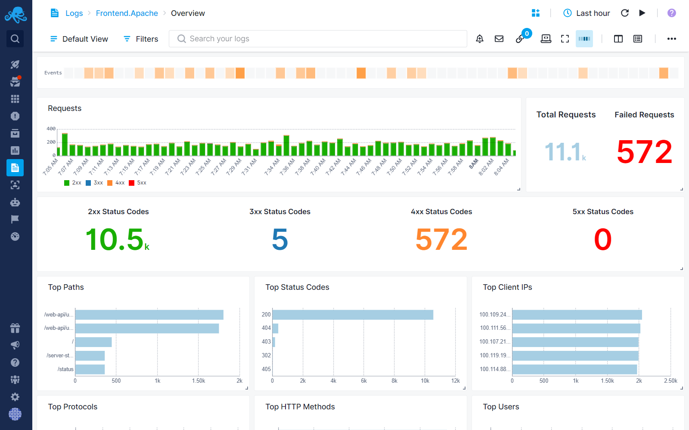
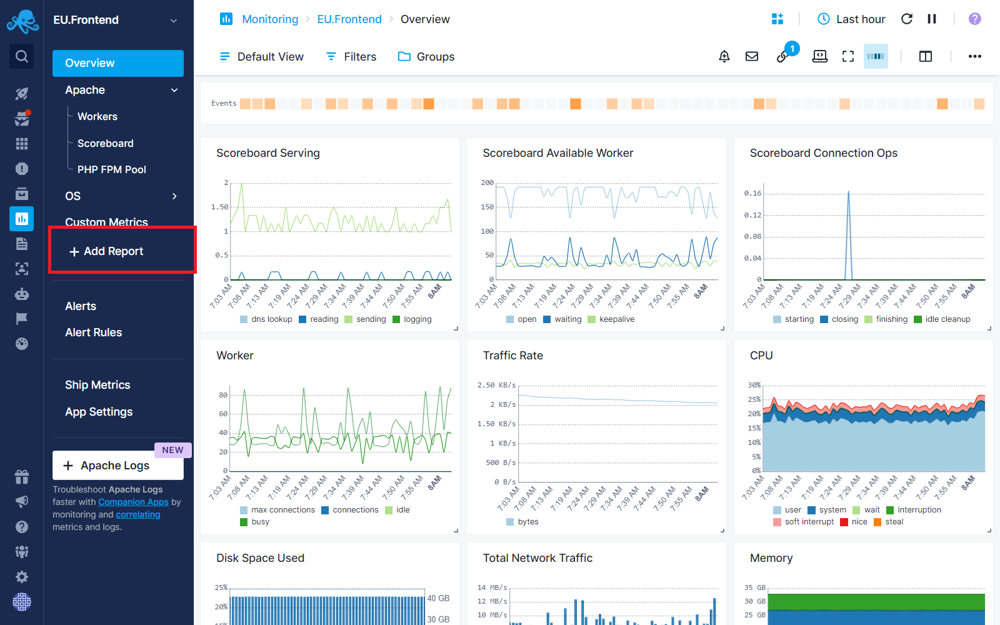

title: What is a Report?
description: Sematext Cloud Reports Guide. Using out-of-the-box reports or custom reports to visualize data.

A report in Sematext Cloud is a collection of visual components, like charts and tables, that help you monitor and analyze your metrics and logs. When you send metrics and logs to Sematext Cloud, we automatically provide you with out-of-the-box reports based on the [integration](https://sematext.com/docs/integration/) you’ve chosen when creating [Monitoring](https://sematext.com/docs/monitoring/) or [Logs](https://sematext.com/docs/logs/) [Apps](https://sematext.com/docs/guide/app-guide/). These reports are designed to highlight the most important data.
For example, if you want to collect metrics from an Apache web server and create an [Apache Monitoring App](https://sematext.com/docs/integration/apache-integration/), the reports will immediately display key metrics such as Scoreboard status, Worker activity, and performance data.

Similarly, if you want to collect logs from an Apache web server and create an [Apache Logs App](https://sematext.com/docs/integration/apache-integration/#apache-logs), the out-of-the-box reports will provide visualizations for logs, such as total and failed requests, response codes, top HTTP methods, and user activity.

On top of the out-of-the-box reports, you can also create Custom Reports tailored to your specific needs.

## Why Create Custom Reports?

While the default reports are a great starting point, you might want to focus on specific data that’s important to you. Maybe you want to track something unique to your setup, or compare different metrics side by side. Or you might be shipping [custom metrics](https://sematext.com/docs/monitoring/custom-metrics/) to your [Monitoring App](https://sematext.com/docs/monitoring/) and create a report to visualize that data. In this case, you can create a custom report that shows exactly what you need to see.

### How to Create a Custom Report

-  Go to your App where you want to create the report.
-  Click on "Add Report" that is available in the left menu panel.

- Add visualization components. You can choose from charts (like line, bar, or pie charts) or tables to display your data using [Chart Builder](https://sematext.com/docs/dashboards/chart-builder/). You can also decide which metrics or logs to show, based on what you want to monitor.

### Managing Report Updates

**Stay notified and stay updated**  
Customized reports are a powerful way to adjust your data visualization to your specific needs. To ensure you always have the latest and most relevant data, Sematext Cloud supports **Report Updates**. Imagine you've customized on of your **Apache Monitoring Reports** to include specific metrics unique to your environment. With Report Updates you'll be notified and can decide whether to keep your custom report as is or not.

With **Report Updates**, you have complete control over how new features to out-of-the-box reports affect your customized versions.

#### How It Works

1. **Out-of-the-Box Reports:**
   - For users who haven't customized their reports, all updates to out-of-the-box reports are applied automatically. No action is needed, you're always up-to-date with the latest features and improvements.

2. **Customized Reports:**
   - If you've customized any reports, you'll get a notification info box when updates are available for those reports. You can:
     - **Fetch new updates**: Bring the latest updates into your customized report while keeping your existing customizations intact.
     - **Overwrite existing reports**: Replace your current customizations entirely with the updated out-of-the-box report.
     - **Ignore and keep your existing report**: Continue using your customized report without fetching the updates. 

   The notification info box can be hidden anytime by clicking the 'hide' button. At any time you can update the report through the Report Settings menu.

#### Why Use Report Updates?

- Stay informed about new features and improvements to out-of-the-box reports.
- Keep your Monitoring and Logs Apps up to date with the latest features.
- Maintain control over your customized reports without unexpected changes.
