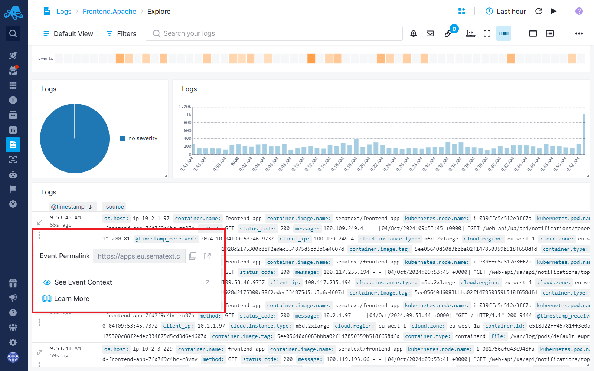
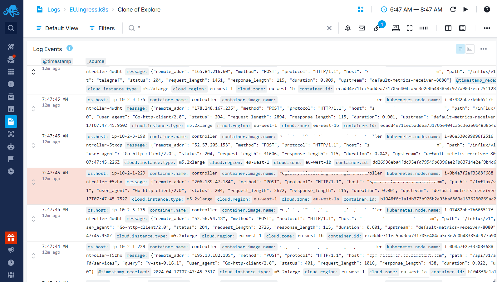
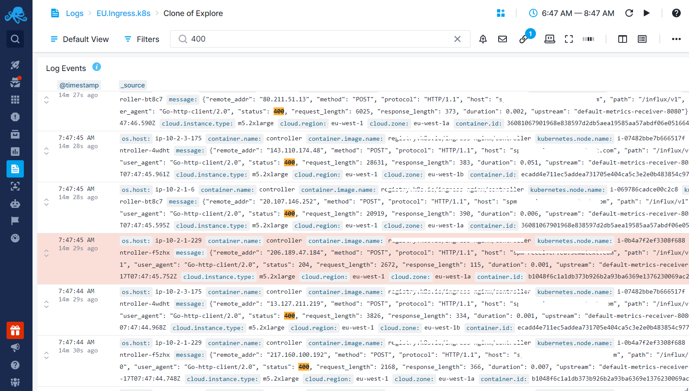

title: Context View
description: Examine logs surrounding a specific log entry, understand the sequence of events leading up to and following a particular event.

When troubleshooting and inspecting logs, you search and filter logs to narrow down your focus, aiming to find log entries that help you understand what, how, why, or when something occurred. When you search, you see only the logs that match your query. However, if you were to manually examine a log file, you wouldn't just see matching log lines. Instead, you'd see all events, allowing you to observe both preceding and subsequent log entries after locating the event of interest.

The Log Context feature operates similarly. Once you've pinpointed a log event of interest, a single click exposes its context. This feature allows you to examine logs surrounding a specific log entry, helping you understand the sequence of events leading up to and following a particular event.

You can access the Log Context directly from the Logs Table by clicking on the three dots located at the beginning of the log row. 

Once in the Context View, the selected log entry is marked, making it easy to identify and analyze it within the context of surrounding logs.

You can then filter logs within the context view, focusing on specific types of logs. In the example below, we filtered to view only logs with the status code 400 coming before and after a particular log entry.

