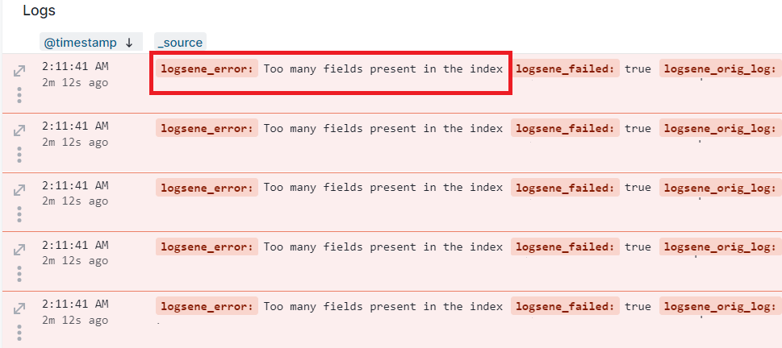
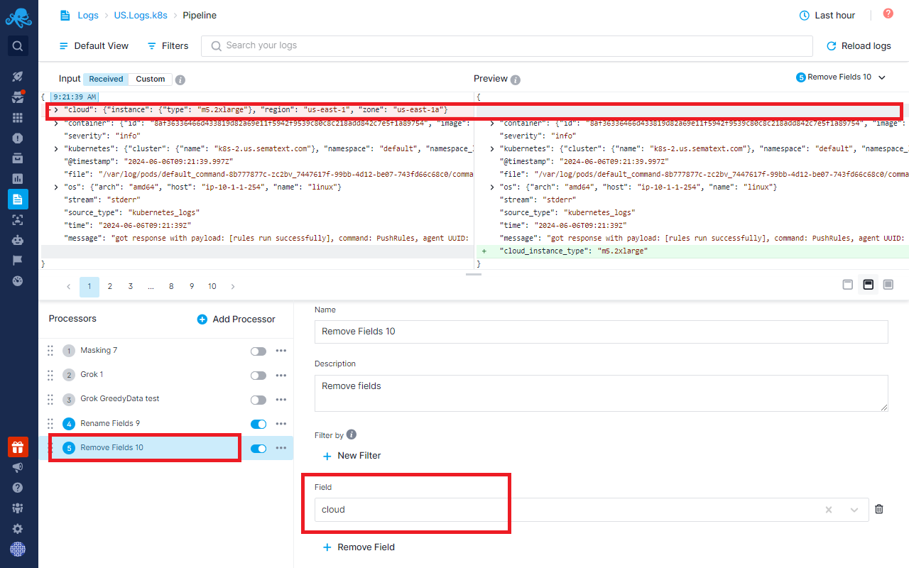

title: Too many fields in the index
description: How to handle too many fields in the index error with Sematext Logs Pipelines

If you are ship log events with a large number of distinct fields you might see the "Too Many Fields Present in the Index" warning in a Logs App:


The "Too Many Fields Present in the Index" error occurs when the number of fields in a Logs App  exceeds **1000**. This error is typically not caused by new log events but by a large number of the pre-existing distinct fields. The error happens when a new event with yet another new field arrives and that, if indexed, would push the total number of distinct fields over the limit.

When this error occurs, you will see a warning message at the top of your logs App indicating that you have failed logs.

If you check the `logsene_error` field in your failed logs, you will see the "Too many fields present in the index" error.



## Solution

There are two ways to solve the problem:

- Identify fields that you don’t really need and prevent them from being shipped to Sematext in the first place
- Identify fields that you don’t really need and drop them before they get stored in your Logs App using Logs Pipelines.

Ideally, the problem would be solved by doing 1. above. 

However, if you cannot drop fields at the log shipper level, you must prevent any extra fields from being added to the Logs App on the Sematext side.

Log events that cause this error often contain objects with sub-fields. You can use [Logs Pipelines](https://sematext.com/docs/logs/pipelines/) to drop such fields before they are saved in the Logs App. Alternatively, if some sub-fields contain useful information that you want to keep, you can first extract such fields to the root level and then drop the object type field with the rest of the unwanted fields.

When this problem is caused purely by top-level fields and not object fields with lots of sub-fields, then we just need to drop the unwanted fields as described further below.

### Extracting Sub Fields with Logs Pipelines

With the [Rename Processor](https://sematext.com/docs/logs/processors-overview/), you can extract sub-fields to the root level.

**Example:**

Imagine you have a cloud object field with 10 subfields. You might really want to keep only two of them.  To do that you’d make them normal, non-object fields:

```
cloud.instance = instance_value
cloud.other_field = other_value
```


Now that the two subfields are top-level fields you can get rid of the whole object field and thus eliminate eight unnecessary fields.

### Drop Fields with Logs Pipelines

Use the [Remove Fields Processor](https://sematext.com/docs/logs/processors-overview/) to remove the `cloud` field altogether from the logs.



However, you will still see the error because the index will retain the 1000 fields from the old data. In this case, contact us at [support@sematext.com](mailto:support@sematext.com) to manually rotate the index for you.

Alternatively, you can go to the [Field Editor](https://sematext.com/docs/logs/fields/#field-editor) and select "Restore Default Fields." This action will automatically rotate the index, and your new logs will be written to a new index without the object fields that were dropped using pipelines.
