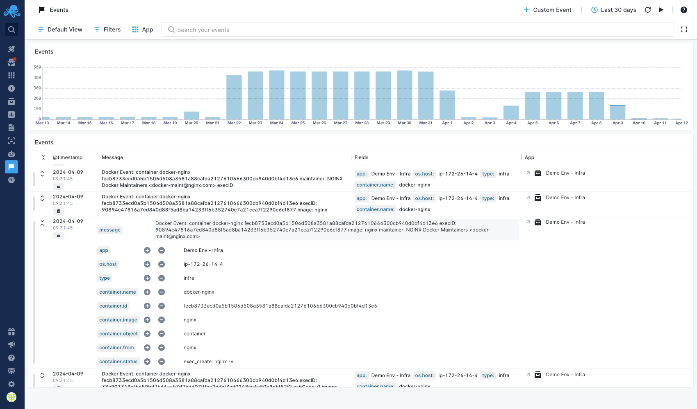

title: Sematext Container Monitoring
description: Monitor Docker and containerd containers, container orchestration systems like Swarm and Nomad, or cloud container orchestration services EKS, ECS, AKS, GKE with Sematext by installing Sematext Agent and using our interface that shows everything in one simple screen.

Monitor [Docker](https://www.docker.com/) and containerd containers, container orchestration systems like Swarm and Nomad, or cloud container orchestration services EKS, ECS, AKS, GKE with Sematext by installing [Sematext Agent](https://sematext.com/docs/agents/sematext-agent/) and using our interface that shows everything in one simple screen.

## Create a Sematext Monitoring App
Creating a Sematext Infra App is as easy as choosing one of our integrations and giving the App a name.

Sematext can easily monitor your infrastructure with the Sematext Agent. You can install the agent during the Infra App creation process by following the Container instructions during environment selection.

Check also:

- [Docker](../agents/sematext-agent/containers/installation/#docker)
- [Docker Compose](../agents/sematext-agent/containers/installation/#docker-compose)
- [Docker Swarm](../agents/sematext-agent/containers/installation/#docker-swarm-enterprise)

## See Container data in Sematext Monitoring
Sematext Agent collects a plethora of metrics about containers (Docker, containerd) and orchestrator platforms and ships that to Sematext Cloud.

You can see host and container metrics or have a high-level overview of all your containers in Infrastructure reports.

Check out the [Sematext Agent installation for containers](../agents/sematext-agent/containers/installation) guide for more info.

## Container Alerting
To save you time Sematext automatically creates a set of default alert rules such as alerts for low disk space. You can [create additional alerts](../alerts) on any metric.

There are 3 types of [alerts](../alerts) in Sematext:

- **Heartbeat alerts**, which notify you when a server is down
- **Threshold-based alerts** that notify you when a metric value crosses a predefined threshold
- **Alerts** based on statistical **anomaly detection** that notify you when metric values suddenly change and deviate from the baseline

## Container Events

[Events](../events/) reflect changes in your infrastructure, from node restarts to container deployments, or changes in running containers. Events can track every container command. Sematext Agent collects events from container runtimes and Kubernetes API. Whenever something goes wrong in your container stack, you can [correlate Logs or Metrics with the time of container events](../events/correlation/).

Refer to the [Agent container events](https://sematext.com/docs/agents/sematext-agent/events/#container-events) page for more details on all container events collected by the Sematext Agent.

## Container Metrics 

Check out the all the [supported Container metrics](https://sematext.com/docs/agents/sematext-agent/containers/metrics/) shipped by Sematext Agent.

## More about container Monitoring
* [Container Monitoring with Sematext Agent](../agents/sematext-agent/)
* [Docker Container Monitoring with Sematext](https://sematext.com/blog/docker-container-monitoring-with-sematext/)
* [Docker Container Monitoring and Management Challenges](https://sematext.com/blog/docker-container-monitoring-management-challenges/)
* [Docker Container Performance Metrics](https://sematext.com/blog/top-docker-metrics-to-watch/)

