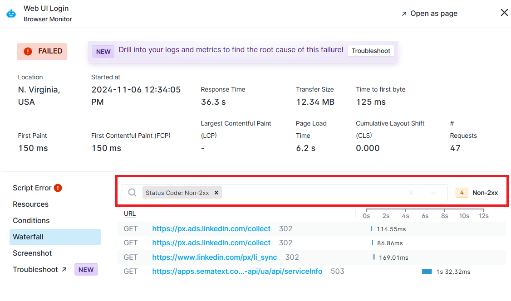

title: Response Codes
description: Response Codes report and filtering features help identify and analyze HTTP and Browser Monitor response codes for better endpoint performance monitoring.

Sematext Synthetics monitors the availability and performance of your endpoints by calling them at specified intervals using [HTTP](https://sematext.com/docs/synthetics/http-monitor/) and [Browser](https://sematext.com/docs/synthetics/browser-monitor/) Monitors. Each endpoint call returns a single response code (for HTTP Monitors) or multiple response codes (for Browser Monitors). We have introduced a new **Response Codes report** for HTTP Monitors that shows the response codes returned from the endpoint calls during the selected time range. Additionally, for Browser Monitors, we've introduced quick filtering in individual monitor runs to easily identify which URLs returned non-2xx responses.

When you make a request to a website or API, the server sends back a response code that tells you whether the request was successful or if there was an issue.

- **2xx: Successful Responses**
These codes indicate that the request was successfully processed by the server.
- **3xx: Redirection Responses**
These codes indicate that the requested resource has been moved, and the client (e.g., a browser) needs to take additional action, such as following a redirect.
- **4xx: Client Errors**
These codes indicate that there was an issue with the request made by the client (the user or application making the request).
- **5xx: Server Errors**
These codes indicate that the server failed to process a valid request, usually due to an issue on the server side.

## HTTP Monitors

Within the single monitor screen, we’ve introduced a Response Codes report that shows the response codes returned from the endpoints during the selected time range.

This report helps you identify when the monitored endpoint fails at specific times. For example, if an expensive database backup occurs every day at midnight and causes a website to return a 503 Gateway Timeout, the Response Codes report can help you spot failures that happen consistently around the same time, allowing you to take action accordingly.

**What You Can See in the Report:**

**Total number of response codes** within the selected time range.

**Response codes over time** for each selected location, helping you identify regular occurrences of failed responses at similar times.

**Average response times by location,** allowing you to compare response codes against response times within the same time range.

**Failed runs table** to help you dig deeper into the issues.

## Browser Monitors

In Browser Monitors, each monitor run includes multiple URL requests (e.g., to resources like images, JavaScript libraries, etc.), and each URL can return different response codes. In the [**Waterfall**](https://sematext.com/docs/synthetics/browser-monitor/#waterfall-chart) tab, you will now see a filter option to filter out non-2xx response codes. When applied, this filter will only show URLs that returned a response code **other than 2xx.**

This filtering feature helps you identify issues with specific URLs in a browser monitor, such as broken links or server errors, without having to sift through successful responses.
